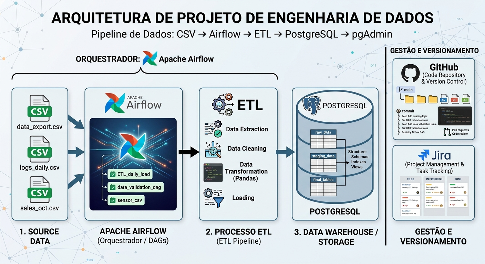
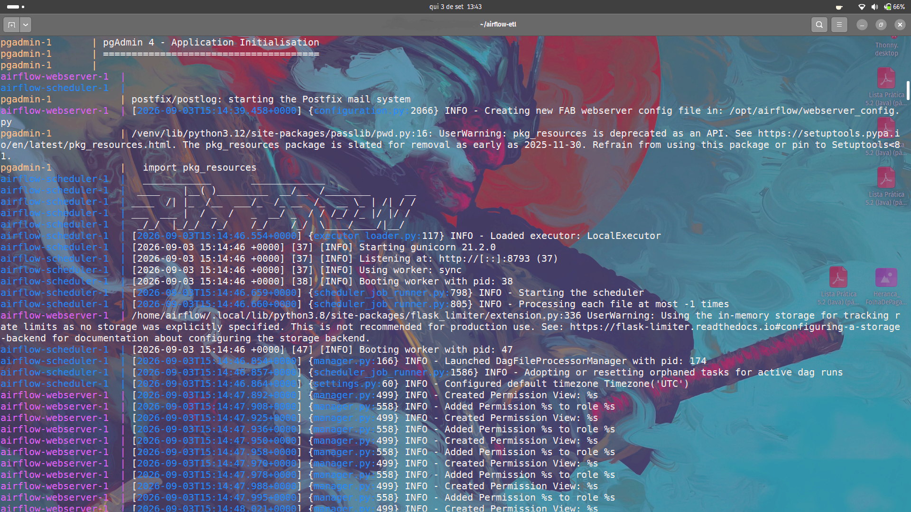

# Users ETL Pipeline with Apache Airflow

## Overview

This project demonstrates a simple **ETL (Extract, Transform, Load)** pipeline orchestrated with **Apache Airflow**.

The pipeline extracts user information from a CSV file, performs a basic transformation, and loads the processed data into a SQLite database. The project serves as an example of how Airflow can be used to automate and schedule data engineering workflows.

---

## Project Architecture

```
users.csv
    │
    ▼
Extract Task
    │
    ▼
Transform Task
    │
    ▼
Load Task
    │
    ▼
SQLite Database
```

The workflow is managed by an Airflow DAG with the following tasks:

1. **Start**
2. **Database Setup**
3. **Extract Data**
4. **Transform Data**
5. **Load Data**
6. **End**




---

## Technologies

| Technology     | Purpose                               |
| -------------- | ------------------------------------- |
| Apache Airflow | Workflow orchestration and scheduling |
| Python         | ETL implementation                    |
| Pandas         | CSV processing                        |
| SQLite         | Lightweight relational database       |
| Postgres       | Relational database                   |
| pgAdmin        | Postgres' client                      |
| Docker         | Containerization                      |
| Docker Compose | Multi-container orchestration         |
| Jira           | Project management                    |


---

## Project Structure

```
.
├── dags/
│   └── data-pipeline-users.py
├──data
│   ├── input
│   │   └── users.csv
│   └── output
│       └── etl_data.db
├── docker-compose.yml
├── .env
├── logs/
├── plugins/
├── secrets/
└── README.md
```

---

## ETL Process

### 1. Extract

The pipeline reads the `users.csv` dataset using **Pandas** and converts the records into Python dictionaries for downstream tasks.

### 2. Transform

The transformation stage currently passes the extracted data through unchanged, serving as a placeholder where future business rules, validations, or data cleaning can be implemented.

### 3. Load

The processed records are inserted into a SQLite database.

Before loading new data, the pipeline:

* Creates the `users` table if it does not already exist.
* Removes existing records.
* Inserts the new dataset.

---

## Airflow DAG

The DAG is configured with:

* Daily schedule
* One retry on failure
* Five-minute retry delay
* Disabled catchup

Task dependency:

```
Start
   │
   ▼
Setup Database
   │
   ▼
Extract
   │
   ▼
Transform
   │
   ▼
Load
   │
   ▼
End
```

---

## Running the Project

### Prerequisites

* Docker
* Docker Compose

### Start Airflow

```bash
docker compose up -d
```

### Open the Airflow Web Interface

```
http://localhost:8080
```

Default credentials (if unchanged):

* Username: `airflow`
* Password: `airflow`



---

## Database Schema

The pipeline creates the following table:

| Column     | Type      |
| ---------- | --------- |
| id         | INTEGER   |
| first_name | TEXT      |
| last_name  | TEXT      |
| email      | TEXT      |
| gender     | TEXT      |
| ip_address | TEXT      |
| created_at | TIMESTAMP |

---

## Learning Objectives

This project demonstrates:

* ETL pipeline development
* Workflow orchestration with Apache Airflow
* Task dependencies
* Python operators
* Data extraction using Pandas
* Loading data into SQLite
* Containerized development using Docker
* Airflow DAG scheduling

---

## Future Improvements

Potential enhancements include:

* Data validation and cleansing
* Logging improvements
* Error handling
* Unit and integration tests
* PostgreSQL instead of SQLite
* Parameterized pipelines
* Multiple DAGs
* Data quality checks
* CI/CD pipeline integration
* Monitoring and alerting

---

## License

This project is intended for educational and learning purposes.

